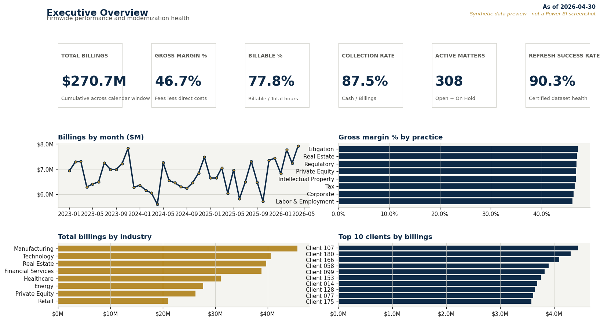
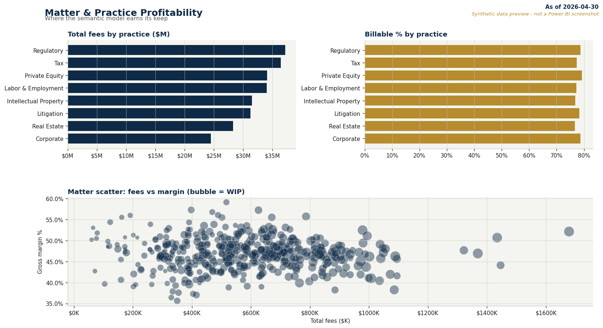
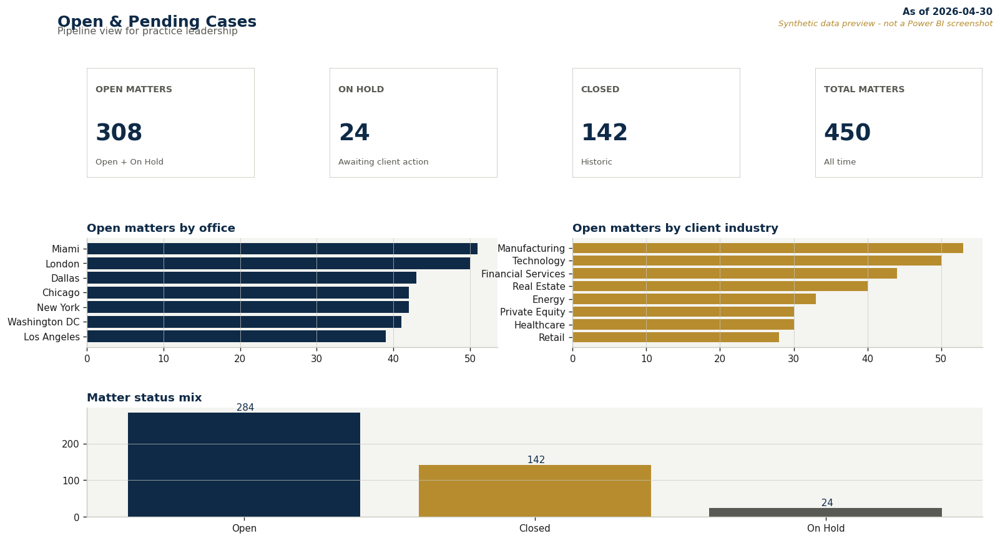
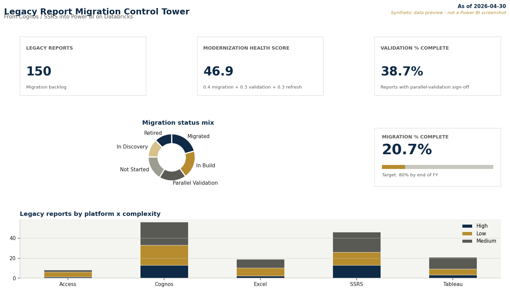
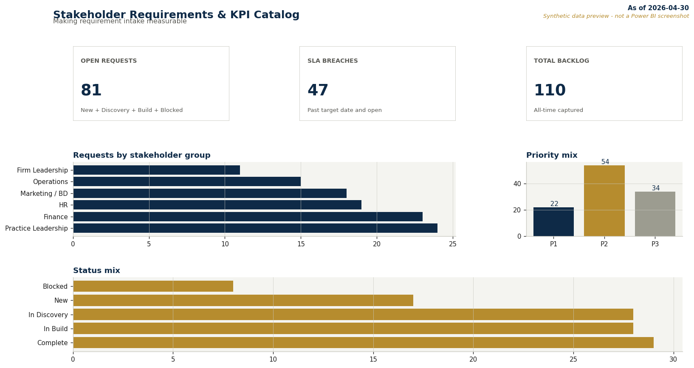
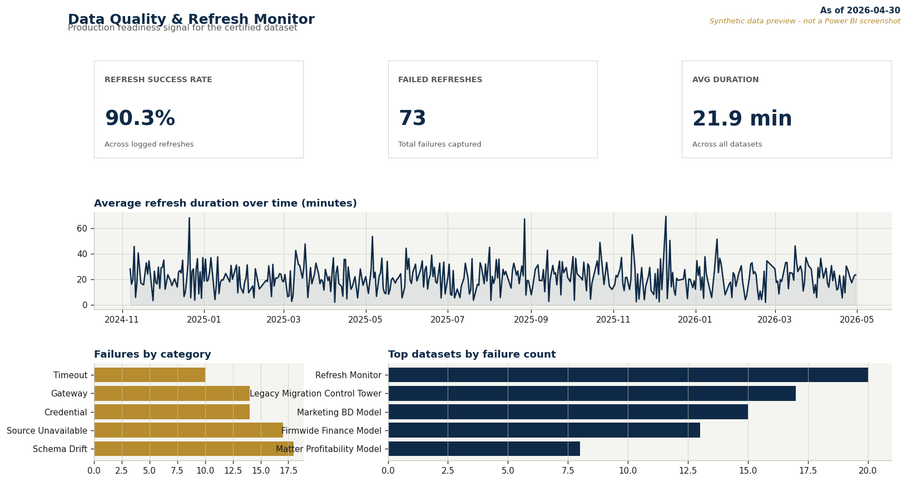
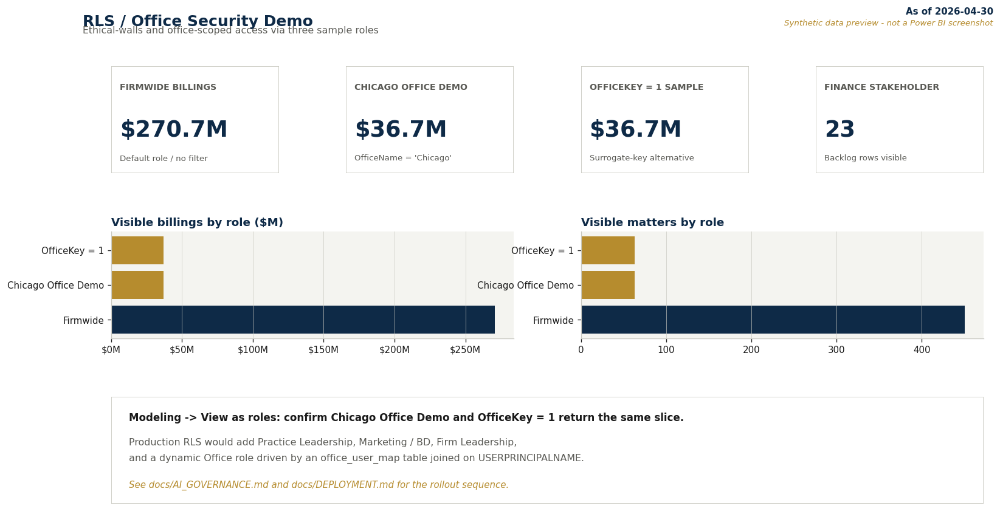
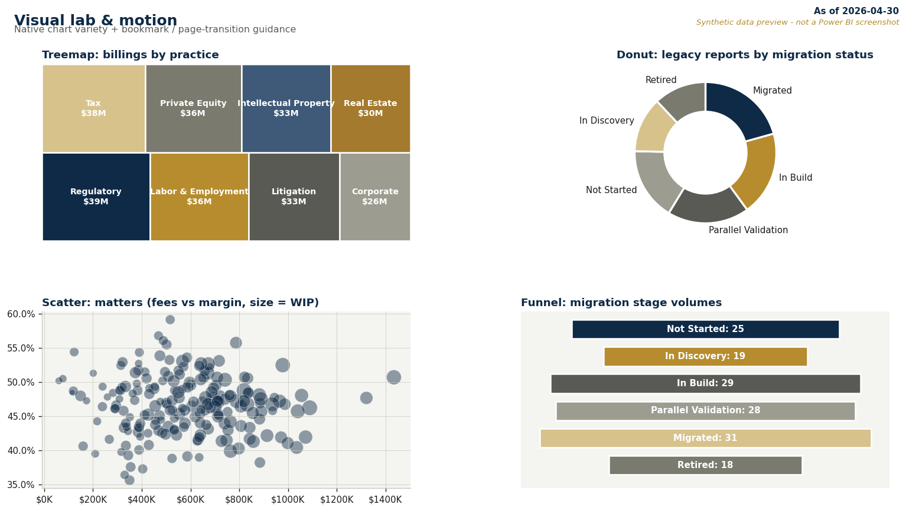
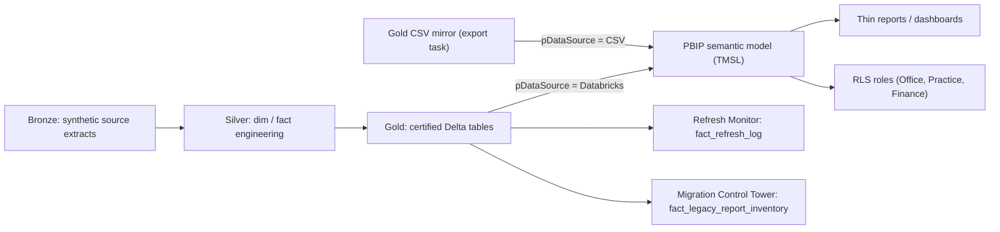

# Legal BI Modernization PBIP Demo Kit

[](https://github.com/prendleman/legal-bi-modernization-pbip/actions/workflows/validate.yml)
[](LICENSE)

> **Synthetic data only.** This demo uses synthetic professional-services / legal-operations data only. It contains **no Sidley, client, matter, financial, or confidential data**. Public Sidley.com attorney names appear in `dim_attorney` for realism only; see [`ATTORNEY_NAMES_ATTRIBUTION.md`](sidley_pbip_spinup_package/docs/ATTORNEY_NAMES_ATTRIBUTION.md). Sidley Austin did not commission, sponsor, or review this repo.

Built for a Sidley Austin **Senior Business Intelligence Engineer** interview process. A source-control-friendly Power BI Project (PBIP) demonstrating legal BI modernization on top of a curated Databricks lakehouse.

## Data preview (not Power BI screenshots)

The PBIP report opens in Power BI Desktop. To make this repo skim-friendly without
Desktop, two scripts render the **same synthetic gold CSVs** into honest previews -
clearly labeled as previews, not screenshots:

[](previews/pages/01_executive_overview.png)

| Page 2 | Page 3 | Page 4 |
| --- | --- | --- |
| [](previews/pages/02_matter_profitability.png) | [](previews/pages/03_open_pending_cases.png) | [](previews/pages/04_migration_control_tower.png) |

| Page 5 | Page 6 | Page 7 |
| --- | --- | --- |
| [](previews/pages/05_stakeholder_backlog.png) | [](previews/pages/06_refresh_monitor.png) | [](previews/pages/07_rls_demo.png) |

| Page 8 | All-in-one HTML mockup |
| --- | --- |
| [](previews/pages/08_visual_lab.png) | [`previews/dashboard_mockup.html`](previews/dashboard_mockup.html) - open in any browser |

See [`previews/README.md`](previews/README.md) for what these are, what they are not, and
how to regenerate them.

## Architecture at a glance



## Quickstart

```powershell
# Clone and enter the repo
git clone https://github.com/prendleman/legal-bi-modernization-pbip
cd legal-bi-modernization-pbip

# Generate the PBIP + CSVs (no third-party deps)
py sidley_pbip_spinup_package\scripts\generate_sidley_pbip.py

# Optional CI smoke (regenerate + parse all JSON)
py scripts\smoke_pbip.py

# Open in Power BI Desktop
start sidley_pbip_spinup_package\output_test\Sidley_BI_Modernization_Demo\Sidley_BI_Modernization_Demo.pbip
```

Databricks pipeline (dry run, no credentials needed):

```powershell
py sidley_pbip_spinup_package\scripts\generate_sidley_pbip.py --databricks --dry-run
```

## Start here

**Full walkthrough lives in the package README**: [`sidley_pbip_spinup_package/README.md`](sidley_pbip_spinup_package/README.md)

It covers the architecture, fast-start commands, JD mapping, deployment story, and every doc listed below.

## What's in the box

| Area | Where to look |
| --- | --- |
| Generator (one-command PBIP regen + UC pipeline) | [`sidley_pbip_spinup_package/scripts/generate_sidley_pbip.py`](sidley_pbip_spinup_package/scripts/generate_sidley_pbip.py) |
| 8-page PBIP report + TMSL semantic model | [`sidley_pbip_spinup_package/output_test/Sidley_BI_Modernization_Demo/`](sidley_pbip_spinup_package/output_test/Sidley_BI_Modernization_Demo) |
| DAX measures, model design, page build plan | [`DAX_MEASURES.dax`](sidley_pbip_spinup_package/docs/DAX_MEASURES.dax) &middot; [`MODEL_DESIGN.md`](sidley_pbip_spinup_package/docs/MODEL_DESIGN.md) &middot; [`PAGE_BUILD_PLAN.md`](sidley_pbip_spinup_package/docs/PAGE_BUILD_PLAN.md) |
| **DAX deep dive** (design choices behind key measures) | [`DAX_DEEP_DIVE.md`](sidley_pbip_spinup_package/docs/DAX_DEEP_DIVE.md) |
| **Migration case study** (1 legacy Cognos report end-to-end) | [`MIGRATION_CASE_STUDY.md`](sidley_pbip_spinup_package/docs/MIGRATION_CASE_STUDY.md) |
| Databricks integration (CSV <-> UC SQL Warehouse) | [`DATABRICKS_INTEGRATION.md`](sidley_pbip_spinup_package/docs/DATABRICKS_INTEGRATION.md) |
| Productionization (asset bundles, UC, MLflow hook) | [`PRODUCTIONIZATION_UC_MLFLOW.md`](sidley_pbip_spinup_package/docs/PRODUCTIONIZATION_UC_MLFLOW.md) |
| Governance (data classification, RLS, certification) | [`AI_GOVERNANCE.md`](sidley_pbip_spinup_package/docs/AI_GOVERNANCE.md) |
| Dev/Test/Prod deployment + retirement flow | [`DEPLOYMENT.md`](sidley_pbip_spinup_package/docs/DEPLOYMENT.md) |
| JD-to-demo mapping + interview talk track | [`JD_TO_DEMO_MAP.md`](sidley_pbip_spinup_package/docs/JD_TO_DEMO_MAP.md) &middot; [`INTERVIEW_TALK_TRACK.md`](sidley_pbip_spinup_package/docs/INTERVIEW_TALK_TRACK.md) |
| Databricks Asset Bundle template | [`databricks/asset_bundle/`](sidley_pbip_spinup_package/databricks/asset_bundle) |

## 90-second pitch

> A small but realistic legal/professional-services BI modernization demo. The theme is migration from Cognos/SSRS-style legacy reporting into Power BI on top of a curated Databricks lakehouse. It includes legal-services entities like matters, practices, offices, attorneys, clients, realization, WIP, collections, and a legacy-report migration control tower. The point isn't the visuals - it's the reusable semantic layer, governed measures, time-intelligence calc group, the Databricks gold-layer integration with a Power Query parameter to flip between CSV and Databricks, and the PBIP/source-control workflow that supports a real BI transformation.

## Project meta

- [License](LICENSE) - MIT, with an explicit no-affiliation notice for Sidley Austin
- [Security policy](SECURITY.md)
- [Changelog](CHANGELOG.md)
