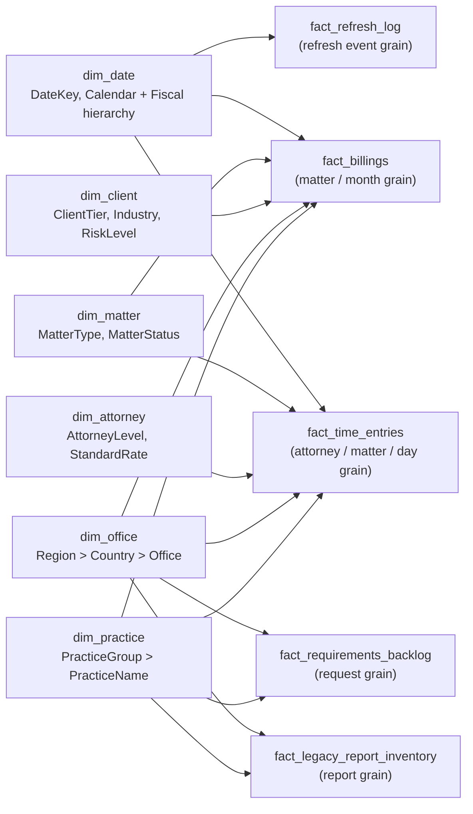

# Model Design

## Architecture

```mermaid
flowchart LR
    subgraph Sources["Source systems"]
        TB["Time and billing"]
        MM["Matter mgmt"]
        ReportInv["Report inventory"]
        Reqs["Stakeholder intake"]
        RefreshTel["Refresh telemetry"]
    end

    subgraph Lakehouse["Databricks lakehouse"]
        Bronze["Bronze - raw"]
        Silver["Silver - typed and conformed"]
        Gold["Gold - dimensional star schema"]
    end

    Sources --> Bronze --> Silver --> Gold

    subgraph PBIP["Power BI - PBIP semantic model"]
        Star["Star schema"]
        Measures["DAX measure layer"]
        CalcGroup["Time intelligence calc group"]
    end

    Gold -->|"Databricks SQL connector"| Star
    CSV["Gold CSVs (demo mode)"] -->|"Power Query parameter toggle"| Star
    Star --> Measures --> CalcGroup --> Reports["Thin reports"]
```



## Star schema



## Grain

| Table | Grain |
|---|---|
| `fact_billings` | One row per matter / month / billing event |
| `fact_time_entries` | One row per attorney / matter / day / work type |
| `fact_legacy_report_inventory` | One row per legacy report being migrated |
| `fact_requirements_backlog` | One row per stakeholder analytics request (includes `ProductManager`, `EpicId` for PM / roadmap alignment) |
| `fact_refresh_log` | One row per dataset refresh event |

## Hierarchies

- `dim_date.Calendar` -> Year > Quarter > Month > Date
- `dim_date.Fiscal` -> Fiscal Year > Fiscal Quarter > Fiscal Month > Date
- `dim_office.Geography` -> Region > Country > Office
- `dim_practice.Practice` -> Practice Group > Practice

## Calculation groups

A `Time Intelligence` calculation group is provisioned with: `Current`, `MTD`, `QTD`, `YTD`, `PY`, `PYTD`, `YoY`, `YoY %`. Apply it as a slicer/filter to reuse every measure across time variants without duplicating DAX.

## Relationships (many-to-one)

```text
fact_billings[DateKey]      -> dim_date[DateKey]
fact_billings[MatterKey]    -> dim_matter[MatterKey]
fact_billings[ClientKey]    -> dim_client[ClientKey]
fact_billings[OfficeKey]    -> dim_office[OfficeKey]
fact_billings[PracticeKey]  -> dim_practice[PracticeKey]

fact_time_entries[DateKey]      -> dim_date[DateKey]
fact_time_entries[MatterKey]    -> dim_matter[MatterKey]
fact_time_entries[AttorneyKey]  -> dim_attorney[AttorneyKey]
fact_time_entries[OfficeKey]    -> dim_office[OfficeKey]
fact_time_entries[PracticeKey]  -> dim_practice[PracticeKey]

fact_legacy_report_inventory[OwningOfficeKey]   -> dim_office[OfficeKey]
fact_legacy_report_inventory[OwningPracticeKey] -> dim_practice[PracticeKey]

fact_requirements_backlog[OfficeKey]   -> dim_office[OfficeKey]
fact_requirements_backlog[PracticeKey] -> dim_practice[PracticeKey]

fact_refresh_log[DateKey] -> dim_date[DateKey]
```

`dim_attorney` still stores `OfficeKey` and `PracticeKey` for labels and ETL lineage, but those columns are **not** related to `dim_office` / `dim_practice` in the model: `fact_time_entries` already joins to office, practice, and attorney, and adding `dim_attorney` -> `dim_*` would create ambiguous paths (for example `fact_time_entries` -> `dim_office` vs `fact_time_entries` -> `dim_attorney` -> `dim_office`).

`dim_matter` still stores `ClientKey`, `OfficeKey`, and `PracticeKey` for lineage, but those columns are **not** related to `dim_office` / `dim_client` in the model: relationships from `dim_matter` to those dimensions would create **ambiguous paths** with `fact_billings` (Desktop refuses to load the semantic model).

The generator writes denormalized **`OfficeName`**, **`ClientName`**, **`ClientIndustry`** (same values as `dim_client[Industry]`), and **`LeadAttorneyName`** on `dim_matter` so matter-only pages (for example **Open & pending cases**) can use slicers and visuals on one table without extra edges.

## RLS demo

Two roles ship by default:

| Role | Table | Filter |
|---|---|---|
| `Chicago Office Demo` | `dim_office` | `[OfficeName] = "Chicago"` |
| `Finance Stakeholder` | `fact_requirements_backlog` | `[StakeholderGroup] = "Finance"` |

Production rollout adds: Practice-Leadership, Marketing/BD, Firm-Leadership, plus an Office-by-User mapping table for dynamic RLS.

## Production path

```text
bronze (raw)
  -> silver (typed, conformed)
  -> gold (BI-ready star schema, governed)
  -> Power BI certified semantic model
  -> thin reports / PBIP / deployment pipeline (Dev -> Test -> Prod)
```

In production the CSV import paths are replaced by the Databricks SQL Warehouse connector and the same model serves every thin report.
