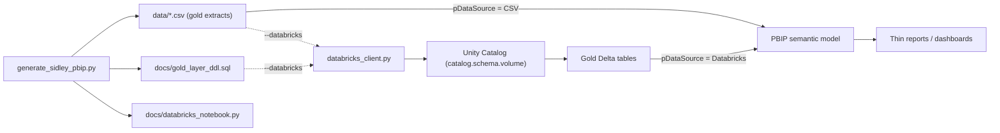

# Databricks Integration

The demo ships two Databricks-aware paths so it can be talked through credibly even before a real workspace is wired up.

## Architecture



## Two-mode data source

`model.bim` exposes Power Query parameters that toggle every fact/dim's source between local CSVs (demo) and Databricks SQL Warehouse (production):

| Parameter | Default | Purpose |
|---|---|---|
| `pDataSource` | `CSV` | Set to `Databricks` to switch the model to live UC tables. |
| `pDatabricksHost` | placeholder | Workspace hostname (no scheme). |
| `pDatabricksHttpPath` | placeholder | `/sql/1.0/warehouses/<id>` from the SQL Warehouse details page. |
| `pDatabricksCatalog` | `sidley_demo` | Unity Catalog catalog name. |
| `pDatabricksSchema` | `gold` | Schema holding the gold tables. |
| `pCsvRoot` | absolute path captured at generation | Used for the CSV branch. |

The deployment pipeline overrides these per stage so the same PBIP file ships to Dev, Test, and Prod unchanged.

## Configuration

Order of precedence (highest wins):

1. Environment variables (recommended for CI).
2. `scripts/databricks.config.json` (gitignored, copy from the `.example`).
3. Built-in safe defaults.

```text
DATABRICKS_HOST            https://adb-xxx.x.azuredatabricks.net
DATABRICKS_TOKEN           <personal access token>
DATABRICKS_WAREHOUSE_ID    <id of a running SQL warehouse>
DATABRICKS_HTTP_PATH       /sql/1.0/warehouses/<id>   (auto-derived if omitted)
DATABRICKS_CATALOG         sidley_demo
DATABRICKS_SCHEMA          gold
DATABRICKS_VOLUME          landing
```

## Running the pipeline

Dry run (no creds, no network calls - works on any laptop):

```powershell
py scripts\generate_sidley_pbip.py --databricks --dry-run
```

Live run (requires credentials):

```powershell
$env:DATABRICKS_HOST  = "https://adb-xxx.x.azuredatabricks.net"
$env:DATABRICKS_TOKEN = "dapi..."
$env:DATABRICKS_WAREHOUSE_ID = "abcdef1234567890"
pip install -r requirements.txt
py scripts\generate_sidley_pbip.py --databricks
```

## Pipeline steps

The `--databricks` flag fires this sequence after CSV/PBIP generation:

1. `ensure_catalog_schema_volume` - idempotent UC provisioning (`CREATE CATALOG/SCHEMA/VOLUME IF NOT EXISTS`).
2. `create_gold_tables` - runs every statement in `docs/gold_layer_ddl.sql`.
3. `upload_csvs` - pushes each generated CSV into `/Volumes/<catalog>/<schema>/<volume>/`.
4. `load_gold_from_volume` - `COPY INTO` each Delta table from the volume.

Every SDK call and SQL statement is logged. With `--dry-run` nothing executes; the log is the rehearsal.

## Sample notebook

`docs/databricks_notebook.py` is a `# Databricks notebook source`-style file showing the bronze -> silver -> gold transforms a data engineering team would own in production. Drop it into a Databricks workspace, run All, and the same gold tables appear - a clean answer to "what would this look like in production?"

## Talking points

- "Logic lives upstream. The notebook produces the gold layer, the PBIP semantic model consumes it."
- "Same model, two sources. The Power Query parameter is how the deployment pipeline switches between dev CSVs and prod gold tables without touching the file."
- "Schema drift is impossible: the same Python dict that builds `model.bim` also writes `gold_layer_ddl.sql`."
