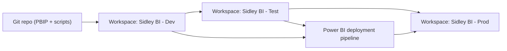

# Deployment & Governance

How this demo would graduate from a single PBIP file into a governed firmwide BI service.

## Workspace topology

| Stage | Audience | Data source | RLS |
|---|---|---|---|
| Dev | BI engineers | Sample/dev Databricks catalog | Off |
| Test | BI + selected stakeholder reviewers | Test catalog (parallel to legacy reports) | On (test roles) |
| Prod | Firm | Prod Databricks gold catalog | On (final roles) |

The Power Query parameters in `model.bim` (`pDataSource`, `pDatabricksHost`, `pDatabricksHttpPath`, `pDatabricksCatalog`, `pDatabricksSchema`) are overridden per-stage by the deployment pipeline rules. No file edits required between Dev / Test / Prod.

## Source control

- The PBIP layout (`*.Report/`, `*.SemanticModel/`, `model.bim`) is committed.
- Generated artifacts under `output/` are ignored - they're reproducible from `scripts/generate_sidley_pbip.py`.
- `.gitattributes` normalizes line endings so the JSON-based PBIP files diff cleanly across Windows / macOS.

## Promotion checklist (Test -> Prod)

1. Data quality: `data_quality_report.md` shows all PASS.
2. Refresh: latest scheduled refresh of the test dataset succeeded.
3. Stakeholder sign-off captured against `fact_requirements_backlog` rows (acceptance criteria field).
4. Legacy report has been parallel-validated against the Power BI replacement (`ValidationStatus = "Validated"`).
5. RLS roles re-tested via "View as role" against named test users.
6. Lineage: certified semantic model is the only data source for promoted thin reports.

## Refresh & observability

- Scheduled refresh runs against the certified semantic model; thin reports do not own their own data sources.
- `fact_refresh_log` is the BI team's observability backbone. The Refresh Monitor page surfaces:
  - Success Rate
  - Avg Duration
  - Failures by `FailureCategory` (Gateway / Credential / Schema Drift / Timeout / Source Unavailable)
- A scheduled job posts to Teams / email when `Refresh Success Rate` drops below threshold.

## Row-Level Security rollout

Production roles to add on top of the demo's **three** sample roles (Chicago by name, Chicago by `OfficeKey`, Finance-scoped requirements backlog):

| Role | Filter |
|---|---|
| Practice Leadership | `dim_practice[PracticeName] = USERPRINCIPALNAME mapping` |
| Marketing / BD | `fact_requirements_backlog[StakeholderGroup] = "Marketing / BD"` |
| Firm Leadership | No filter (firmwide) |
| Office (dynamic) | Driven by an `office_user_map` table joined on `OfficeKey` |

## Legacy retirement

The Migration Control Tower drives retirement decisions, not the other way around.

1. Legacy report is captured in `fact_legacy_report_inventory` with platform + owner.
2. Replacement Power BI report is built and published to Test.
3. Validator confirms parallel run for one full reporting cycle (`ValidationStatus = "Validated"`).
4. Stakeholder sign-off recorded against the replacement.
5. Legacy report status moved to `Retired`. Cognos / SSRS access removed.
